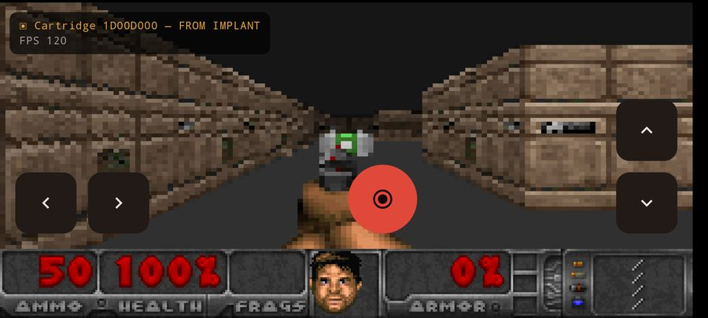
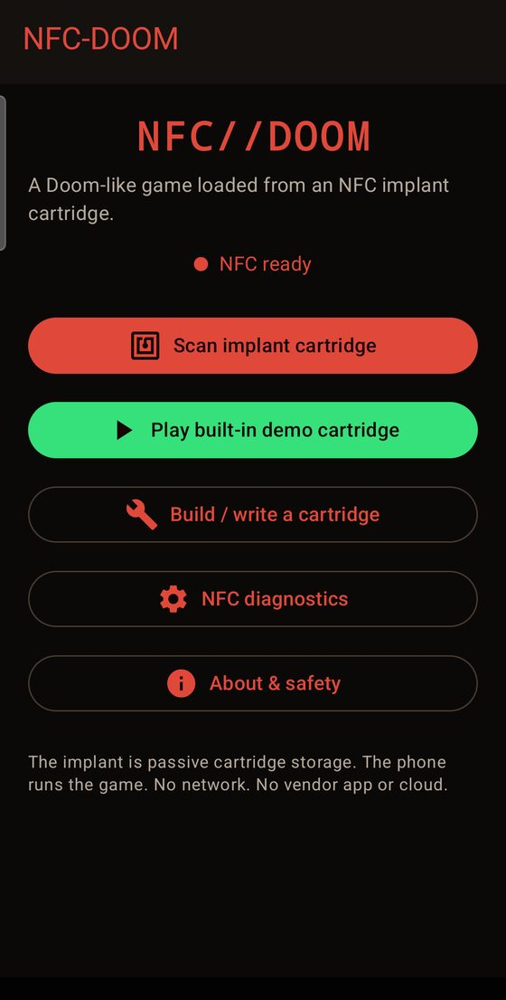
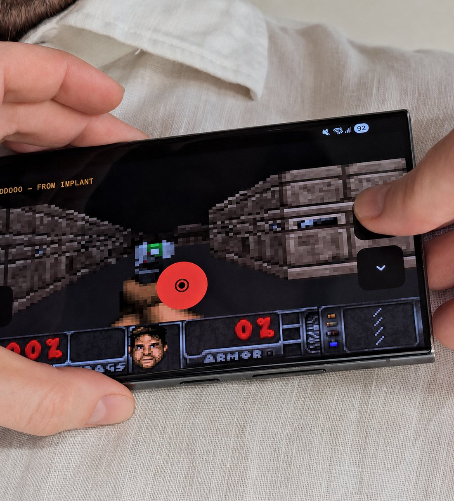

# NFC-DOOM

**A Doom-like first-person shooter whose level is read off an NFC chip implanted in my chest.** The phone is the console; the implant is the cartridge. No internet, no cloud — just a chip and a phone.



*The level above was read out of a chip implanted in my chest. The phone is doing the rendering — the implant just stores the cartridge.*

There's a long tradition of getting Doom to "run" on absurd things — pregnancy tests, printers, microwaves. The dirty secret of most of those is that the device isn't really doing the work; a microcontroller bolted on the side is. So I built an honest version of the bit: the phone is the console, and the **NFC implant is the cartridge.**

> Scan the implant → a tiny binary cartridge is read off the chip → a Doom-like first-person level boots from it. No internet, no app servers, no cloud. Just a chip in my chest and a phone.

> **Wait — why a chip in your chest?**
>
> Fair question; this isn't a hobbyist hand implant. A while back I founded and ran a startup built on a simple idea: take the "dumb" ID microchips you already put in pets and add a *thermometer*, so a vet could read an animal's core body temperature instantly with a single scan. The company didn't survive — but I kept one of the chips, and it's implanted in my chest. I've thought about having it removed; before I do, it felt like a fun excuse to build something against it. (There's a Swedish write-up of that startup [over at Breakit](https://www.breakit.se/artikel/34885/totte-lofstrom-vill-satta-ett-chipp-i-din-katt-husdjur-ar-familjemedlemmar).) And the kicker: this whole project — the engine, the cartridge format, the entire NFC read/write saga below — came together in **about one working day**, pair-programming with Claude Code. Without an AI pair, the same result would realistically have been a few weeks of full-time work — reverse-engineering the raw NFC stack alone could eat most of a week, and the WAD parser and the raycaster math are each a couple of days of fiddling on their own.

## 01 · The idea

The implant is a passive **NFC Forum Type 5 / ISO 15693** tag (an NXP ICODE-style chip) with about a kilobyte of memory. That's nowhere near enough to hold a game — but it's plenty to hold a *cartridge*: a compact description of one level. The Android phone holds the engine and the art; the chip holds the level you actually play. Exactly like an old console cartridge.

| On the phone (the "console") | On the implant (the "cartridge") |
|---|---|
| The raycaster engine, input, the wall textures, monster sprites, the weapon and the status bar. Generic — it can play any cartridge. | ~250 bytes: the 16×16 map, where the monsters and pickups go, the player start, a seed and a theme. The actual level you play. |

## 02 · The cartridge format

I designed a tiny binary format that fits comfortably under the chip's usable ~1000 bytes. The whole demo level is **248 bytes**. Map tiles are packed at 4 bits each; there's a CRC32 at the end so a corrupt read is caught instead of crashing the game.

| Section | Size | What |
|---|---|---|
| Header | `20 B` | magic `IDOOM`, version, map size, player start, seed, theme, counts |
| Map | `128 B` | 16×16 tiles, 4 bits each (wall / door / exit / hazard / empty) |
| Entities | `4 B each` | x, y, type, flags — the monsters |
| Items | `3 B each` | x, y, type — health / ammo / keys |
| Footer | `4 B` | CRC32 of everything above |

It's stored on the chip as a single custom NDEF MIME record (`application/vnd.implantdoom.cartridge`), which also lets Android auto-launch the app when you tap the implant. *(Full byte-level spec further down, in [Cartridge format v1](#cartridge-format-v1).)*

## 03 · It looks like Doom — but it isn't Doom

The first prototype was flat-shaded boxes. It didn't *feel* like anything. The fix wasn't to ship id Software's artwork — that's copyrighted, and the DOOM logo is a trademark. Instead I used [Freedoom](https://freedoom.github.io/), a free, BSD-licensed set of Doom-compatible game art. I wrote my own WAD parser to decode its palette, picture and texture formats into PNGs, then fed those into the renderer: real textured walls, billboarded monster sprites, a weapon, and the iconic status bar with the face.

To sell the retro feel I render the 3D view into a tiny **~128-pixel-wide** framebuffer and scale it up with nearest-neighbour filtering — big chunky pixels, "Doom on a huge screen." The monsters chase you with line-of-sight; walk into the green exit to finish the level.



*The app: scan a cartridge, play the built-in demo, or build & write your own to a chip.*

## 04 · The hard part: writing to a thing in your chest

Reading and playing the demo was the easy 20%. Getting 248 bytes *onto* the implant — and back off — was a genuine fight with Android's NFC stack and a tiny, weakly-coupled antenna. The build log of failures, in order:

- **"NDEF format failed."** Android's high-level NDEF write is notoriously unreliable on Type 5 tags. So I dropped down and spoke raw `ISO 15693` — writing the NDEF data block-by-block myself, never touching the chip's lock/security bits.
- **"Tag is out of date."** Using foreground dispatch, Android kept re-polling the lingering implant and invalidating my tag handle mid-write. Fix: switch to `Reader Mode`, which hands you one stable handle for the whole operation.
- **"Tag was lost" — every single time.** The chip simply ignored my commands. Turns out it only answers *addressed* ISO 15693 commands at a *low data rate*, not the usual non-addressed/high-rate. So I made the writer auto-probe four command framings and use whichever the chip actually replies to.
- **Reads dying halfway through.** A subdermal antenna couples weakly, so Android's frequent "is the tag still there?" checks would flag a brief dropout and kill the handle. Fix: a long `presence-check delay` so it rides through the wobble.
- **A broken Capability Container.** Block 0 read `E1 40 FF 09` — the value that over-reports memory and hides NDEF from Android entirely. So I also read the cartridge back raw, bypassing the CC, independent of whether Android can see it.

When it finally landed, the log was a thing of beauty:

```
// writing the cartridge to the implant
using profile addr+lo; CC=[E1 40 80 09]
writing 63 blocks ... wrote 63/63
verify OK -> SUCCESS (248 bytes)

// later: reading it back to play
read: using profile addr+lo
read: recovered 248 NDEF bytes  // cartridge loaded from the chip
```

And the payoff: now you can **close the app, tap the implant from the home screen, and Android boots you straight into the level** — in landscape, no menus. Chip in chest → Doom.



*The real thing, in hand — no emulator, no screenshot trickery. The level you're walking through came off a chip in my chest.*

## 05 · Tech stack

`Kotlin` · `Jetpack Compose` · `Custom DDA raycaster` · `Android NFC (Reader Mode)` · `ISO 15693 / NFC-V` · `Freedoom (BSD) art` · `Custom WAD parser` · `No network permission`

Everything stays on the device. The app has no `INTERNET` permission at all — it can't phone home even if it wanted to. There's a built-in demo cartridge so the whole thing works on any phone (or an emulator) without an implant, a cartridge builder to generate and write your own levels, and a read-only NFC diagnostics screen for poking at the chip.

## 06 · Where this could go next

If you're strict about it, this version cheats a little: the *level* lives on the chip, but the engine and the art live on the phone. The chip is a cartridge, not a computer.

So the next step that keeps nagging at me isn't a bigger level — it's a smaller computer. Instead of storing *data* for a game the phone already knows how to play, you store the *entire program* on the chip and make the phone a completely generic player with no game logic in it at all. The vehicle is a tiny virtual machine. [CHIP-8](https://en.wikipedia.org/wiki/CHIP-8) is a lovely fit — a mid-1970s VM with a 64×32 monochrome screen and about 35 instructions, simple enough to write in ~150 lines. A whole Space Invaders built for it fits in roughly **300 bytes**, comfortably inside this implant's ~2 KB.

Do that and the phone becomes a console that knows nothing about any particular game: it reads the program off the chip, runs it, done. Re-flash the chip with a different ROM and you get a different game — same app, not one line changed. *That* is the honest version of "a game that lives on the chip," and it's only an afternoon's work away. I probably won't get to it — but maybe you will.

---

*Everything below is the developer reference: the byte-level cartridge format, the NFC details, the project layout, and how to build and run it.*

> **Concept:** This is a *Doom-like game loaded from an NFC implant cartridge.*
> Doom does **not** run on the implant. The NFC implant is not a computer — it is a
> ~1 KB tag that stores a compact binary "cartridge" describing one level. When the
> phone scans the implant, the app reads the cartridge and starts the game.

---

## What it does

* Reads NFC **NDEF** records from an implant and looks for a custom MIME record:
  * **MIME type:** `application/vnd.implantdoom.cartridge`
* Parses a compact binary **cartridge format (v1)** that fits under ~1000 bytes.
* Launches a simple first-person **raycaster** using the cartridge data.
* Ships with a built-in **demo cartridge** so it works with no NFC at all
  (emulator-friendly).
* Includes a **cartridge builder/writer** that generates a cartridge and writes it
  to a writable NDEF tag.
* Includes a read-only **NFC/Type-5 diagnostics** screen (UID, tech list, NDEF
  availability/size, records, MIME detection, and ISO 15693 / NFC-V details).
* Keeps **all data local** — no network, no vendor app/API/server/SDK/cloud.

## What it is **not**

* It contains **no id Software Doom assets**: no original IWAD data, title screens,
  sprites, textures, music, sound effects or maps, and not the trademarked DOOM logo.
  The first-person artwork is from **Freedoom** — a free, BSD-licensed Doom-compatible
  art set (attribution in `app/src/main/assets/doomgfx/`), decoded into PNGs by a small
  WAD parser written for this project. The engine is an original Doom-like raycaster.
* It does **not** use Dsruptive's app, APIs, servers, SDKs or cloud.
* It does **not** request the `INTERNET` permission.

---

## The tag

* Expected tag type: **NFC Forum Type 5 / ISO 15693 / NFC-V** (e.g. an NXP ICODE
  DNA style implant).
* The reference implant exposed **256 blocks × 4 bytes = 1024 bytes** of raw memory,
  leaving roughly **1000 usable NDEF bytes**.
* ISO 15693 UIDs start with `E0` and are 8 bytes; tools differ on byte order — some
  show them MSB-first (`E0 04 …`), others reversed (`… 04 E0`). The diagnostics screen
  prints both orders for whatever tag you scan. (No specific UID is committed here.)

### Capability Container note

For Android home-screen NDEF reading to work on the reference implant, **block 00
(the Type-5 Capability Container) had to be `E1 40 80 09` (hex `E1408009`)**. An
earlier broken value `E140FF09` advertised too much memory and stopped Android / NXP
apps from detecting NDEF correctly.

**This app never writes block 00**, lock bits, AFI, DSFID or passwords. The CC value
is shown in the app for reference only.

---

## Cartridge format v1

All integers are **little-endian** unless noted. Total layout:

```
[ Header 20 B ][ Map 128 B ][ Entities 4·N ][ Items 3·M ][ CRC32 4 B ]
```

### Header (20 bytes)

| Offset | Size | Field            | Notes                                            |
|-------:|-----:|------------------|--------------------------------------------------|
| 0      | 5    | magic            | ASCII `IDOOM`                                     |
| 5      | 1    | version          | `0x01`                                            |
| 6      | 1    | flags            |                                                  |
| 7      | 1    | mapWidth         | 16                                               |
| 8      | 1    | mapHeight        | 16                                               |
| 9      | 1    | playerStartX     | 0–15                                             |
| 10     | 1    | playerStartY     | 0–15                                             |
| 11     | 1    | playerStartAngle | 0=E, 64=S, 128=W, 192=N                           |
| 12     | 4    | seed             | uint32                                           |
| 16     | 1    | textureThemeId   |                                                  |
| 17     | 1    | entityCount      |                                                  |
| 18     | 1    | itemCount        |                                                  |
| 19     | 1    | reserved         | must be 0 for now                                |

### Map (128 bytes for 16×16)

256 cells × 4 bits, row-major, **two cells per byte**: low nibble = first
(even-index) cell, high nibble = second (odd-index) cell.

Tile IDs: `0` empty, `1` wall, `2` door, `3` exit, `4` hazard, `5–15` reserved.

### Entities (4 bytes each)

`x, y, type, flags` — types: `1` basic enemy, `2` turret, `3` boss placeholder.

### Items (3 bytes each)

`x, y, type` — types: `1` health, `2` key, `3` ammo placeholder.

### Footer (4 bytes)

`CRC32` (standard, little-endian) of **all preceding bytes** (everything except the
trailing 4-byte CRC itself).

### Size

The default demo cartridge is **208 bytes**:

```
Header 20 + Map 128 + Entities 8·4=32 + Items 8·3=24 + CRC 4 = 208
```

This is intentionally small and leaves room for future features. The codec refuses
to build/accept anything larger than **1000 bytes**.

---

## NDEF serialisation

The cartridge is stored as a **single MIME NDEF record** with type
`application/vnd.implantdoom.cartridge` and the raw cartridge bytes as the payload.
It is **not** stored as Text or URI. (A debug-only URI helper exists in
`NdefCartridge` but is never the primary format.)

A custom MIME type lets Android auto-launch the app from a written implant via the
`NDEF_DISCOVERED` intent filter.

---

## Project structure

```
app/src/main/kotlin/com/implantdoom/
├── MainActivity.kt            NFC adapter + foreground dispatch + intent routing
├── cartridge/                 Cartridge model + binary codec (pure Kotlin)
│   ├── Cartridge.kt           Data model, tile/entity/item types
│   ├── CartridgeCodec.kt      Encode/decode, nibble packing, CRC32
│   ├── CartridgeException.kt
│   └── DemoCartridge.kt       Built-in demo + seeded MapGenerator
├── nfc/                       NFC layer
│   ├── NdefCartridge.kt       MIME record (de)serialisation
│   ├── NfcReader.kt           Tag -> diagnostics + parsed cartridge (read-only)
│   ├── NfcWriter.kt           NDEF write / format (never locks)
│   └── NfcVDiagnostics.kt     Read-only ISO 15693 system-info + block reads
├── game/                      Raycaster engine (pure Kotlin, no Compose)
│   ├── GameLevel.kt           Mutable level state from a cartridge
│   ├── Raycaster.kt           Grid DDA raycaster + line-of-sight
│   ├── GameState.kt           Player, vitals, update loop, shooting
│   └── Textures.kt            Procedural colours (no imported assets)
└── ui/                        Jetpack Compose UI
    ├── NFC-DOOMApp.kt      NavHost over the 7 screens
    ├── AppViewModel.kt        Single source of truth + NFC orchestration
    ├── Components.kt          MapPreview, HexDump, InfoRow, HoldButton…
    └── screens/               Home, Scan, Details, Play, Builder, Diagnostics, About
```

Unit tests live in `app/src/test/kotlin/com/implantdoom/cartridge/`.

---

## Build & run

### Requirements

* JDK 17
* Android SDK with **platform 35** and **build-tools 35** (and an NFC-capable device
  for the NFC features; the demo + builder work on the emulator).

The repo includes a Gradle wrapper (Gradle 8.9, AGP 8.7.2, Kotlin 2.0.21).

### From the command line

```bash
# Build the debug APK
./gradlew :app:assembleDebug          # Windows: gradlew.bat :app:assembleDebug

# Run the unit tests
./gradlew :app:testDebugUnitTest

# Install on a connected device/emulator
./gradlew :app:installDebug
```

The APK is written to `app/build/outputs/apk/debug/app-debug.apk`.

> `local.properties` must point `sdk.dir` at your Android SDK. Android Studio writes
> this automatically; it is git-ignored.

### From Android Studio

Open the project folder and let it sync, then Run ▶ the `app` configuration. Any
recent Android Studio (Koala / Ladybug or newer) works.

---

## How to write a demo cartridge

1. Open **Build / write a cartridge** from the home screen.
2. (Optional) tap **Load the built-in demo cartridge**, or tweak seed / entities /
   items / theme to generate your own. The screen shows a live map preview, the byte
   count, the size-limit check and the CRC status.
3. Tap **Arm write — then tap implant**.
4. Hold your implant to the phone's NFC antenna. The app writes a single MIME NDEF
   record and reports success/failure. If the tag is blank but `NdefFormatable`, it
   is formatted first (never locked / never made read-only).

## How to scan and play

* **With an implant:** open **Scan implant cartridge** and hold the implant to the
  phone. If it carries an NFC-DOOM cartridge, the app loads it and offers
  **Details** / **Play**. A written implant will also cold-launch the app straight
  into the cartridge.
* **Without NFC:** tap **Play built-in demo cartridge** on the home screen, or load
  the demo from the Scan / Builder screens.

### Controls

On-screen buttons: rotate left/right, move forward/back, and a fire button. Walk into
the green **exit** tile to finish the level. Hazard tiles and enemies hurt you;
health/ammo/key pickups help.

---

## Safety & privacy

* No `INTERNET` permission; the app cannot reach the network.
* Tag data never leaves the device.
* Writing only ever writes an NDEF message. The app does **not** lock tags, set
  passwords, write-protect, or modify AFI / DSFID / lock bits / CC / security.
* The raw ISO 15693 block reads on the diagnostics screen are **read-only** and gated
  behind a clearly labelled developer toggle.

## License / content

The project's own source code is released under the **MIT licence** — see
[`LICENSE`](LICENSE); do whatever you like with it. The engine is an original
Doom-like raycaster, and the bundled first-person art is from **Freedoom**, used
under its BSD licence (see the files under
`app/src/main/assets/doomgfx/`). It does **not** include or redistribute id Software's
copyrighted Doom data or the trademarked DOOM logo. "Doom" is referenced only
descriptively; this is a Doom-*like* project, not Doom.
